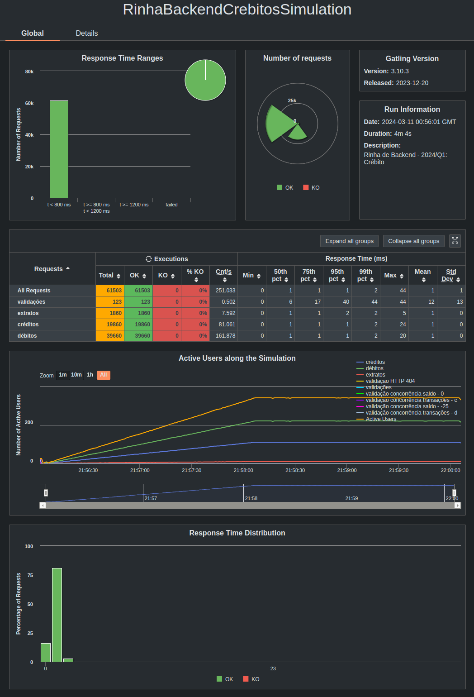
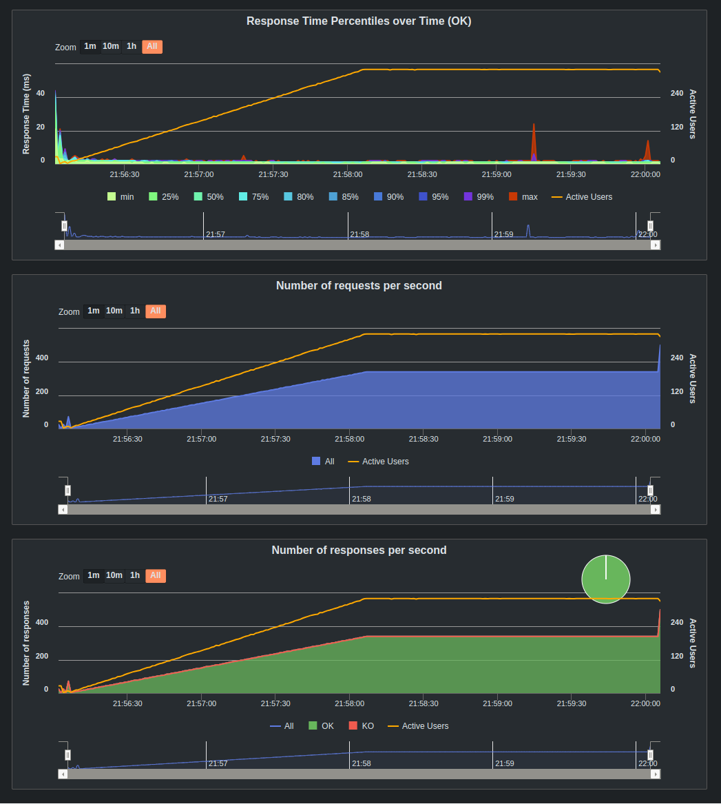

# Rinha de backend

Implementação em elixir da [rinha de backend 2024 Q1](https://github.com/zanfranceschi/rinha-de-backend-2024-q1).

## Outras implementações

- [Golang](https://github.com/ogabriel/rinha-de-backend-golang-2024-q1)

## Resultados

|CPU|RAM|
|---|---|
|Ryzen 5900X|32GB|

```
Simulation RinhaBackendCrebitosSimulation completed in 245 seconds
Parsing log file(s)...
Parsing log file(s) done in 0s.
Generating reports...

================================================================================
---- Global Information --------------------------------------------------------
> request count                                      61503 (OK=61503  KO=0     )
> min response time                                      0 (OK=0      KO=-     )
> max response time                                     44 (OK=44     KO=-     )
> mean response time                                     1 (OK=1      KO=-     )
> std deviation                                          1 (OK=1      KO=-     )
> response time 50th percentile                          1 (OK=1      KO=-     )
> response time 75th percentile                          1 (OK=1      KO=-     )
> response time 95th percentile                          1 (OK=1      KO=-     )
> response time 99th percentile                          2 (OK=2      KO=-     )
> mean requests/sec                                251.033 (OK=251.033 KO=-     )
---- Response Time Distribution ------------------------------------------------
> t < 800 ms                                         61503 (100%)
> 800 ms <= t < 1200 ms                                  0 (  0%)
> t >= 1200 ms                                           0 (  0%)
> failed                                                 0 (  0%)
================================================================================

Reports generated, please open the following file:
```

### Resultado do gatling navegador



